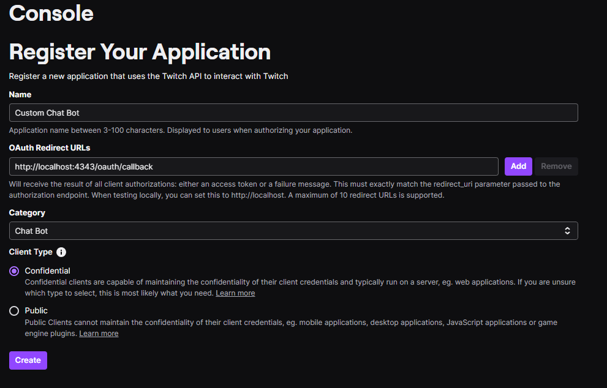

# BonkyBot
A custom Twitch bot for the community, built with love by BonkyWonky aka WilfredOwen/Bonksolid.

# Features

## Config
* Loadable configuration
* One time setup instructions
## Chatbot
### Broadcaster Commands
* `!mod <username>` mods user
* `!permamod <username>` mods user, if they get timed out, bot will remod them after they type their next message
* `!unmod <username>` revokes mod and permamod status
### Chatter Commands
* `!brick` in chat, randomly throws virtual brick at another random viewer, will timeout user if it hits broadcaster
* `!brick <target>` in chat, throws virtual brick at target, will timeout user if it hits broadcaster
* `!target <username>` will set brick target to nominated username, if successfully hit via `!brick` then they'll timeout the target chatter (target must have been chatting in the channel beforehand)
* `!d20` randomly rolls a number between 1 - 20, times out user if result is 1, mods user if it's their first result is 20 for the session

# Setup Instructions
## App Setup
This section will detail how to get your CLIENT_ID and CLIENT_SECRET details to allow the bot to make API calls to Twitch.

1. While logged into your main (owner) Twitch account, access https://dev.twitch.tv/console/apps.
2. Click on the "Register Your Application" button.
3. Enter your name (e.g. Custom Twitch Bot).
4. Enter a redirect URL of `http://localhost:4343/oauth/callback`.
5. Enter a category of *Chat Bot*.
6. Set the **Client Type** to *Confidential*.

Your settings should look like this:

Once done, click on Create, and access your application settings and take note of your CLIENT_ID and CLIENT_SECRET.

## Username to ID Lookup
Access [this webpage](https://www.streamweasels.com/tools/convert-twitch-username-to-user-id/) to find your Twitch user IDs.

Enter your desired username into the box and click the button. This will return your user ID values for your BOT_ID and OWNER_ID accounts, which are required for the bot to function correctly.

* OWNER_ID = your personal Twitch account ID.
* BOT_ID = the Twitch account ID of the bot account.

## Bot Setup

1. Create a new Twitch account. This will be the dedicated bot account. 
2. Follow the steps in [Username to ID Lookup](#username-to-id-lookup) to find the ID of this account. This will be your BOT_ID.
3. Follow steps in [App Setup](#app-setup) to create a new Twitch application for the bot account. This will be used to generate the CLIENT_ID and CLIENT_SECRET for the bot.
4. Run the bonkybotconfig.exe.
5. Load the OWNER_ID, BOT_ID, CLIENT_ID and CLIENT_SECRET values into the config window. The CLIENT_ID and CLIENT_SECRET values should be from the Twitch application you created in step 3. The OWNER_ID and BOT_ID values should be from the Twitch account you created in step 1. Press **Load config items** and restart application once done.
6. Press the buttons under the **Setup** section in order to generate the OAuth token for the bot account. The 2nd button will open a new window in your browser where you'll need to login to your main/broadcasting Twitch account, this will authorise your bot to make actions on your behalf. 
7. Once done, press the 3rd button and open a new incognito window and paste the URL into the address bar where you will need to log into the bot account and authorize the application, this will allow your bot to send messages in chat.
8. Close bonkybotconfig.exe.
9. Run bonkybot.exe and click **Launch Bonky Bot** to enable the bot.

## Troubleshooting

While bonkybot is running, click **Open config and log folder** to open the config folder for bonkybot. Archive this folder into a .zip using 7z or Windows zip and send these to @bonksolid on Discord if you need further assistance.

# Contributions
This bot is open source and contributions are welcome. Please fork the repository and create a pull request with your changes. If you have any suggestions or feature requests, please create an issue on the repository.

## Credits

Thanks to the following people for their contributions and testing to support this project:

### Twitch chatters
* baconater250
* e1sieq
* lolffy_
* mc1arence
* haminator100