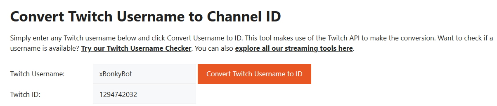

# BonkyBot
A custom Twitch bot for the community, built with love by BonkyWonky aka WilfredOwen/Bonksolid.

# Features

## Config
* Loadable configuration
* One time setup instructions
## Chatbot
* `!mod <username>` mods user
* `!permamod <username>` mods user, if they get timed out, bot will remod them after they type their next message
* `!unmod <username>` revokes mod and permamod status
* `!brick` in chat, randomly throws virtual brick at another random viewer, will timeout user if it hits broadcaster
* `!brick <target>` in chat, throws virtual brick at target, will timeout user if it hits broadcaster
* `!target <username>` will set brick target to nominated username, if successfully hit via `!brick` then they'll gain arbitrary points (WIP)
* `!d20` randomly rolls a number between 1 - 20, times out user if result is 1

# Setup Instructions
## App Setup
This section will detail how to get your CLIENT_ID and CLIENT_SECRET details to allow the bot to make API calls to Twitch.

1. While logged into your main (owner) Twitch account, access https://dev.twitch.tv/console/apps.
2. Click on the "Register Your Application" button.
3. Enter your name (e.g. Custom Twitch Bot).
4. Enter a redirect URL of `http://localhost:4343/oauth/callback`.
5. Enter a category of *Chat Bot*.
6. Set the **Client Type** to *Confidential*.

Your settings should look like this:

Once done, click on Create, and access your application settings and take note of your CLIENT_ID and CLIENT_SECRET.

## Username to ID Lookup
Access [this webpage](https://www.streamweasels.com/tools/convert-twitch-username-to-user-id/) to find your Twitch user IDs.

Enter your desired username into the box and click the button. This will return your user ID values for your BOT_ID and OWNER_ID accounts, which are required for the bot to function correctly.

* OWNER_ID = your personal Twitch account ID.
* BOT_ID = the Twitch account ID of the bot account.

## Bot Setup

1. Create a new Twitch account. This will be the dedicated bot account. 
2. Follow the steps in [Username to ID Lookup](#username-to-id-lookup) to find the ID of this account. This will be your BOT_ID.
3. Follow steps in [App Setup](#app-setup) to create a new Twitch application for the bot account. This will be used to generate the CLIENT_ID and CLIENT_SECRET for the bot.
4. Run the bonkybotconfig.exe.
5. Open a new browser / incognito mode, log in as the bot account and visit http://localhost:4343/oauth?scopes=user:read:chat%20user:write:chat%20user:bot
6. In your main browser whilst logged in as your account, visit http://localhost:4343/oauth?scopes=channel:bot%20moderator:read:chatters%20channel:manage:moderators%20channel:manage:vips%20moderator:manage:shoutouts%20moderator:manage:banned_users
7. Close bonkybotconfig.exe.
8. Run bonkybot.exe to launch your bot.

## Troubleshooting

Database and logs can be found in `%PROGRAMDATA%\BonkyBot\` where there will be a `logs` folder and a `db` folder.

Close the application, archive this folder into a .zip using 7z or Windows zip and send these to @bonksolid on Discord if you need further assistance.